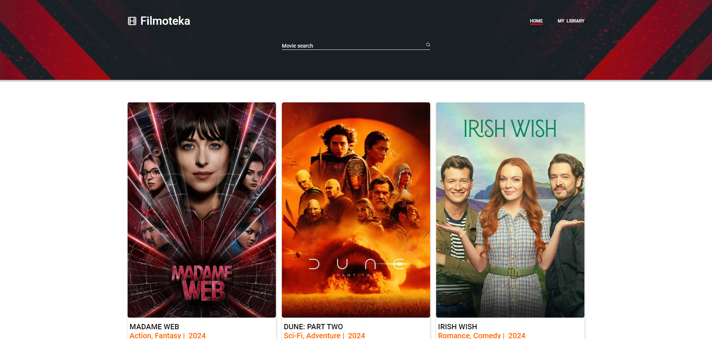

#  🎥 Filmoteka 

---

## 🗂️ Project description 

### Description

Film library is a service for searching movies, connected to the backend API. You can
search movies and add them to watched and queue library in Web Storage.

### Used Technologies:
- HTML
- CSS JavaScript
- SAAS(SCSS)
- Parcel

### Acceptance Criteria
- The layout is fixed in pixels.
- Responsive and cross-browser layout:
  - Mobile: 480px;
  - Tablet: 768px;
  - Desktop: 1200px.
- Mobile First approach
- BEM methodology

## ⚙️ Deployment 

To deploy this project, you need to perform the following steps:

1. **Clone the repository**: Use the `git clone` command to clone this
   repository to your computer.
2. **Install the dependencies**: Open a terminal in the root of the project and
   run `npm install` or `yarn install` to install all required dependencies.
3. **Setting environment variables**: Create a `.env` file in the root folder
   and add the necessary environment variables that you need for the project
   according to the `.env.example` file.
4. **Run the application**: Run the `npm run dev` or `yarn dev` command to run
   the project on the local server.
5. **Deploy**: To deploy this project to a production server, use hosting
   platforms.
